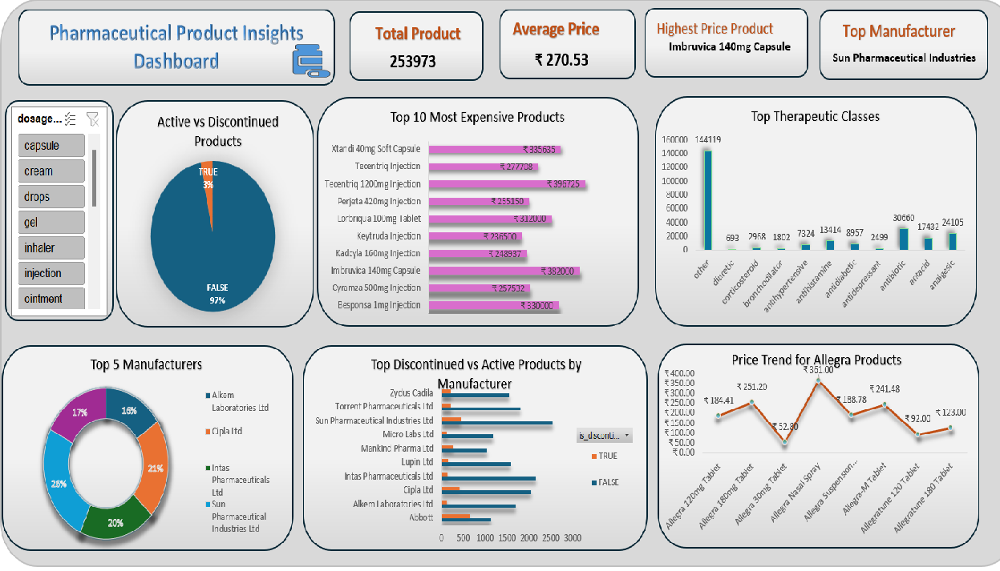

# 💊 Pharmaceutical Product Analysis

A comprehensive analysis and visualization of Indian Pharmaceutical Products using R and Excel.  
The project includes data cleaning, visual exploration, KPI insights, and an interactive Excel dashboard.

---

## 📁 Project Files

| File                          | Description                                                         |
|------------------------------|----------------------------------------------------------------------|
| `pharma_analysis.R`          | R script for cleaning and exploring the dataset                     |
| `pharma_analysis.Rmd`        | R Markdown version of the analysis with embedded visuals            |
| `pharma_dashboard.xlsx`      | Final Excel dashboard with charts, KPIs, and slicers                |
| `pharma_product_dashboard.png` | Preview of the Excel dashboard (image format)                      |
| `pharma_analysis.html`       | R Markdown HTML report (optional view)                              |

---

## 📊 Dashboard Preview

---

## 📈 Dataset

- **Dataset Name**: Indian Pharmaceutical Products  
- **Source**: [Kaggle – Indian Pharmaceutical Products](https://www.kaggle.com/datasets/rishgeeky/indian-pharmaceutical-products)  
- **Note**: Due to file size limits, the dataset is not uploaded to this repo.

---

## 📌 Key Charts in the Dashboard

- Top 10 Most Expensive Products  
- Top 5 Manufacturers  
- Top Therapeutic Classes  
- Price Trend for Allegra Products  
- Top Discontinued vs Active Products by Manufacturer  
- Pie chart of Product Status  
- Heatmap of Products by Therapeutic Class and Manufacturer

---

## 🔍 Insights & Business Implications

### **Key Insights**

1. **Top 10 Most Expensive Products**  
   → These represent high-value items with potential pricing risks.  
   **Business Insight**: Review if the pricing strategy supports value and demand.

2. **Top 5 Manufacturers**  
   → Market is concentrated among a few players.  
   **Business Insight**: Smaller companies can find niche markets to compete.

3. **Top Therapeutic Classes**  
   → High frequency in areas like antibiotics and allergy treatment.  
   **Business Insight**: Focus marketing or R&D efforts on these segments.

4. **Price Trend for Allegra Products**  
   → Stable pricing observed over the product line.  
   **Business Insight**: Indicates consistent demand or strong brand presence.

5. **Discontinued vs Active Products**  
   → High discontinuation rates in some brands.  
   **Business Insight**: Companies can analyze causes for discontinuation to refine product strategy.

---

## 🛠️ How to Reproduce

1. Open `pharma_analysis.R` or `pharma_analysis.Rmd` in RStudio.  
2. Run the script to clean data and generate visualizations.  
3. Review the Excel dashboard in `pharma_dashboard.xlsx`.

---

## ✅ Tools Used

- **R**: Data cleaning and visualization (`dplyr`, `ggplot2`, `readr`)  
- **RMarkdown**: Report generation  
- **Excel**: PivotTables, PivotCharts, Slicers, KPIs, and Dashboard creation

---

## 📌 Future Work

- Add statistical tests or regression analysis  
- Deploy an interactive Shiny app version of the dashboard  
- Include a finalized PDF report (coming soon)

---

## 📬 Contact

**Author**: Apeksha  
GitHub: [@apeksha1403](https://github.com/apeksha1403)  
